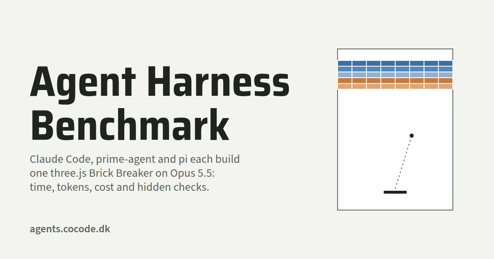

# Agent harness benchmark

What does the harness around a model change? Three agent harnesses, **Claude Code**, **prime-agent** and **pi**,
each build the same game, **Brick Breaker** (`spec.md`), on the same model, Opus 5.5 at high thinking. Each build is
kept in this project under `runs/<builder>/`, and graded by hidden checks the builder never sees.

## Website

[agents.cocode.dk](https://agents.cocode.dk/): the results, and every build playable.

## Features

- Three builders, one session each, the same prompt, the same empty checkout.
- Each run records minutes, dollars, tokens by kind (cache read, cache write, uncached input, output) and turns.
- 13 hidden checks grade each finished game through its WebMCP tools.
- `gallery.py` builds the results page from the finished runs.

### Builders

| Run | Harness | Command |
|---|---|---|
| `claude` | Claude Code | `claude -p --model claude-opus-5-5 --effort high`, Read, Edit, Write and Bash allowed, no MCP servers |
| `prime-agent` | prime-agent | `prime-agent -p --no-session --model anthropic/claude-opus-5-5 --thinking high` |
| `pi` | pi | `pi -p --no-session --model anthropic/claude-opus-5-5 --thinking high` |

Fixed for every run: the model, the prompt, a 45-minute limit and no repairs. Each harness runs as installed,
with its own system prompt, tools and context files.

## Build from Source

Prerequisites:

- Python 3. The harness uses only the standard library.
- git
- [uv](https://docs.astral.sh/uv/), for `uvx`. It fetches Playwright when a suite or the hidden checks run.
- Google Chrome or Chromium. Set `CHROME` to its path if it is not on the `PATH`.
- The three CLIs, `claude`, `prime-agent` and `pi`, signed in with access to Opus 5.5.

Clone and run:

    git clone https://github.com/cocodedk/agent-benchmark
    cd agent-benchmark
    python3 bench.py all             # all three builders at once
    python3 bench.py run pi          # one builder
    python3 bench.py status          # how each run ended
    python3 bench.py grade pi        # the hidden checks again, on a finished run
    python3 gallery.py               # writes site/: the results page and each game
    uvx --with playwright python scripts/prove_site.py   # drives the results page's WebMCP tools

- A build happens in `~/lean-tmp/agent-bench/work`, outside this project, so it never sees `hidden/` or another
  run. Set `BENCH_WORK` to use another folder.
- `run` and `all` replace the run's folder in `runs/`.

## Architecture

    bench.py            the harness: all, run, grade, status
    gallery.py          builds site/, the results page
    page.html           the results page template; gallery.py fills in its data
    spec.md             the game's spec, "Brick Breaker"
    seed/               the checkout every run starts from: CLAUDE.md (AGENTS.md links to it), test/, vendor/ (three.js)
    hidden/checks.py    the 13 hidden checks; never copied into a run
    runs/<builder>/     one folder per run: run.json, log/, game/, hidden.json, screenshot.png

## License

Apache-2.0. See [LICENSE](LICENSE).
